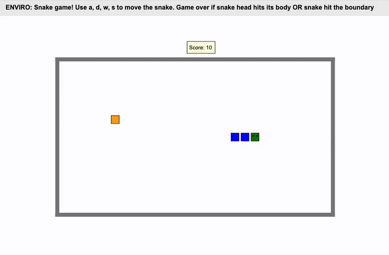

# Snake Simulator

## Overview

The project aims to build a Snake simulation using the Enviro and Elma frameworks. The player controls a snake that moves in four directions (up, down, left, right) to eat food, causing the snake's body to grow in length. The goal is to achieve the highest possible score without colliding with the snake's own body or the game boundaries.



## Key Challenges and Solutions

1. **Snake Movement and Direction Control**

   - **Challenge**: Ensuring smooth movement and preventing the snake from reversing direction.
   - **Solution**: Implemented key event handlers (`w`, `a`, `s`, `d`) to control the snake’s direction, with logic to prevent reverse movement. The snake moves in discrete steps (`step_size = 25`) at a fixed interval (`move_interval = 0.01` seconds) for smooth, continuous motion. The `current_direction` string tracks the snake’s heading, and reverse inputs are not allowed (e.g., can’t move left if moving right).

   ```c++
   watch("keydown", [&](Event &e) {
    //...skip other code ...//
    if (k == "s" && current_direction != "up") { 
        DOWN = true; UP = false; LEFT = false; RIGHT = false; 
        current_direction = "down";
    }
   });
   ```
   **Explanation**: The if conditions ensure that pressing the reverse key (e.g., `s` while moving "up") is ignored, maintaining game integrity. The `move_snake()` function uses `teleport()` to move the head by `step_size`, aligning with a grid-based movement system.

2. **Snake Body Follow-Up Movement**

   - **Challenge**: Ensuring that the snake's body segments follow the movement of the head.
   - **Solution**: Each time the snake head moves, all body segments update their positions accordingly. The head moves first, followed by each segment moving to the `prev_position` of the segment ahead of it.

   ```c++
   body_segments[i]->teleport(body_segments[i-1]->x(), body_segments[i-1]->y());
   ```
   **Explanation**: The `body_segments` stores `agent*` which include snake head and all snake body segments. Each snake body position is teleport to previous body segment which is stored in this vector `body_segments`.
   
3. **Food Consumption and Snake Growth**

   - **Challenge**: Detecting when food is eaten and adding a new segment to the snake body.
   - **Solution**: Event `eaten` is used to trigger `food_eaten()` to add a new segment at the tail’s position. The new segment is added at the last known location of the snake's tail using `add_agent`. A `pending_segment` flag ensures the new segment is fully integrated before proceeding further in `update()`.

   ```c++
   void food_eaten() {
       pending_segment = true;
       Agent* last_segment = body_segments.back();
       json style = {{"fill", "blue"}, {"stroke", "black"}};
       Agent& new_segment = add_agent("snake_body", last_segment->x(), last_segment->y(), 0, style);
       body_segments.push_back(&new_segment);
       pending_segment = false;
   }

   void update() {
       if (is_food_eaten) { // Flag set by event "eaten"
            // ... skip other code ...//
           food_eaten(); // Call function to add new segment
           while(pending_segment) {
               continue;
           }
           is_food_eaten = false;
       }
       move_snake();
       // ... skip other code ...//
   }
   ```
    **Explanation**: The `last_segment` stores snake tail location and the new body segment will locate at here. Then later in `update()` the whole body will be moved to new locations.

4. **Collision Detection (Self and Boundaries)**

   - **Challenge**: Ending the game when the snake collides with itself or the game boundary.
   - **Solution**: Implemented a boundary check (-340 to 340, -190 to 190) and a collision detection mechanism that exits the game when the snake head collides with its body or a boundary. A special condition ignores the first body segment when checking for collisions to avoid false detections during movement updates.

   ```c++
   bool check_valid_state() {
    // ... skip the boundary checking code...//
    // check snake head/body collision
    notice_collisions_with("snake_body", [&](Event& e) {
        // ... skip other code ...//
        if (collision_body_id == body_segments[1]->get_id()) {}
        else {
            printf("\nGAME OVER: SNAKE HEAD HITS ITS BODY!\n");
            exit(0);
        }
    });
   }
   ```
    **Explanation**: Ignoring body_segments[1] prevents false game overs when the head moves and the first segment follows into its old position.
    
## Installation and Setup (Docker-Based)

### **Prerequisites**

- Ensure you have Docker installed on your system.

### **Steps to Run**

1. **Clone this repository:**
   ```sh
   git clone https://github.com/yirulin-chloe/520-Assignments.git
   cd final_project
   ```
2. **Run the game inside a Docker container:**
   ```sh
   docker run -p80:80 -p8765:8765 -v .:/source -it klavins/enviro:v1.61 bash
   ```
3. **Open a browser and go to** `http://localhost:8765` **to start playing.**

4. **Run the following code.**
    ```sh
    make
    esm start
    enviro
    ```

## Usage

- **Use the `w`, `a`, `s`, and `d` keys to move the snake: up, left, down, right.**
- **Eat food to grow longer and increase your score (each food item is worth +10 points).**
- **Avoid colliding with the walls and the snake body to prevent a game over.**

## Acknowledgments

- **[Enviro Framework](https://github.com/klavinslab/enviro.git)**: Used for building and simulating the environment.
- **[ELMA](https://github.com/klavinslab/elma.git)**: Used for event-driven programming and state machine implementation.
